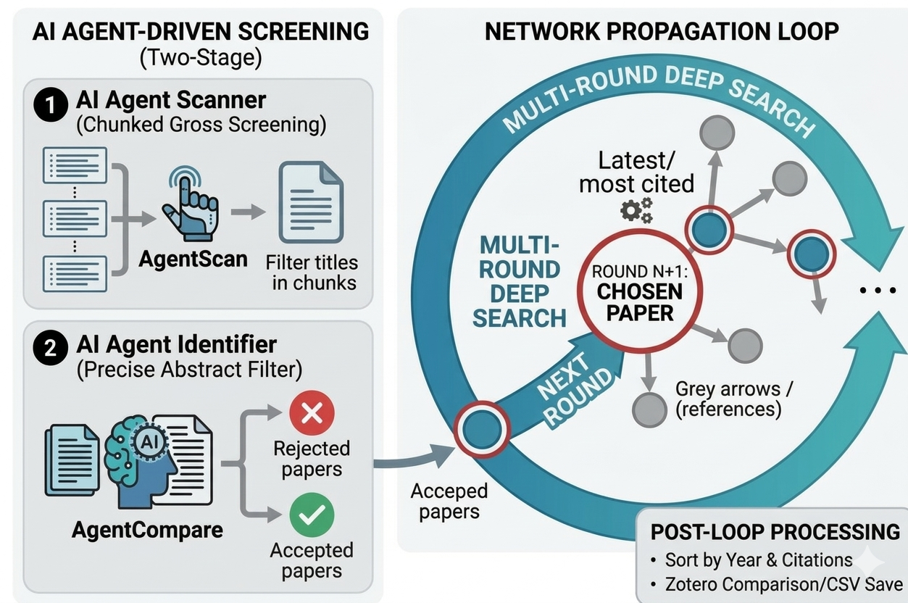

## Paper Deep Search

做科研时，最常用的一种高效找文献方式是：**先找到一篇很“对味”的种子论文，然后顺着它的引用和被引网络一圈圈往外扩散**。传统做法需要在数据库里反复点开引用、逐篇读摘要、人工筛选，既耗时也容易漏掉好论文。  

现在有了大模型强大的语义理解能力，我基于 **智谱 GLM** 和 **Semantic Scholar** API 做了这个小工具，希望把这套“从一篇出发扩撒式找论文”的流程尽量自动化，让你把时间主要花在读论文和思考上。

---

## 核心功能

<p align="center">
  
</p>


- **从种子论文出发自动扩散**
  - 输入一篇论文的 DOI 作为种子（如：`10.48550/arXiv.2411.14679`）。
  - 基于 Semantic Scholar Graph API 获取该论文的引用和被引论文。
  - 支持多轮扩散，按一定策略选择下一轮种子论文（最相关、最新、被引最多、随机）。

- **LLM 智能筛选相关论文**
  - 用 GLM-4-Flash 对论文摘要做两步筛选：
    - 粗筛：成批判断哪些论文“大致相关”；
    - 精筛：逐篇判断是否“真正属于目标主题”。
  - 支持传入额外要求 (`require`)，尽量过滤不太相关的论文。

- **Zotero 文库去重（可选）**
  - 读取 Zotero 导出的 CSV（需要有 `Title` 列）。
  - 自动跳过已经在文库中的论文，只保留“新发现”的论文。
  - 会额外导出一个 `不包含在zotero中的新论文.csv`，方便后需要查看及提供给AI做文献综述。

---

## 使用智谱 GLM-4-Flash 模型

本项目通过智谱的 **OpenAI 兼容接口** 调用 `glm-4-flash` 模型：

- 模型特点：**速度快、完全免费**，非常适合批量判断论文是否相关。

**非常感谢智谱提供的 GLM-4-Flash 免费模型和开放接口。**

### 获取智谱 API Key

1. 打开智谱官网：`https://bigmodel.cn` 并注册/登录。  
2. 进入「API Key 管理」页面（如：`https://bigmodel.cn/usercenter/proj-mgmt/apikeys`）。  
3. 新建一个 API Key（形如 `sk-xxxx`），复制并妥善保存。  

在代码中，把 `main.py` 里 `main` 函数调用中的 `api_key=""` 改成你的 Key 即可。

---

## 快速开始

1. **环境与依赖**

   - Python >= 3.9  
   - 在项目目录下安装依赖（推荐直接使用 `requirements.txt`）：

   ```bash
   pip install -r requirements.txt
   ```

   `requirements.txt` 中目前包含：

   ```txt
   openai
   pandas
   requests
   ```

2. **配置参数**

   打开 `main.py`，找到：

   ```python
   if __name__ == "__main__":
       paper_deep_search(
           api_key="你的智谱APIKey（建议用环境变量读取）",
           paper_seed="arXiv:2411.14679",
           topic="你的研究主题（中英文均可）",
           require="额外限定条件（可为空字符串）",
           round_deep_search=2,
           type_choose_next_paper="most_relevant",  # latest / most_cited / random / most_relevant
           min_year=2020,
           flag_precise_screen=True,
           flag_filter_zotero=True,
           zotero_csv="我的文库.csv",
       )
   ```

   - 把 `api_key` 改成你的智谱 Key；  
   - 把 `paper_doi` 改成你想扩散的那篇“种子论文”；  
   - 用 `topic` + `require` 描述你真正关心的研究问题和筛选标准；  
   - 如需与 Zotero 去重，将 `flag_filter_zotero=True`，并确认 `zotero_csv` 文件存在且包含标题列。  

3. **运行脚本**

   ```bash
   python main.py
   ```

   程序会按设定轮数从种子论文出发扩散，利用大模型筛选出与主题高度相关的论文，并按“年份优先 + 引用数优先”排序输出结果。

---

## 目前不足
- 目前开展的测试十分有限，文献引用抓取的可靠性和文献判别精度无法严格保证。
- 欢迎继续魔改，比如改进检索与判别机制、拓展成skill等。

## Citation

```bibtex
@misc{paper_deep_search,
  title        = {Paper Deep Search: LLM-based citation network expansion tool for literature search},
  author       = {Tengjie Zheng},
  year         = {2026},
  howpublished = {\url{https://github.com/your-username/your-repo-name}}
}
```

